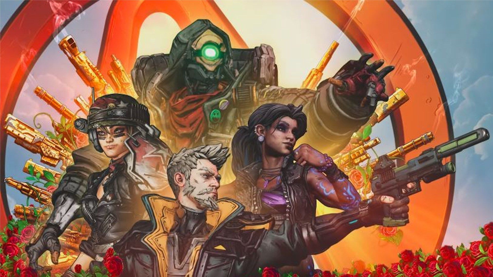

Borderlands 3
=============

Borderlands 3 is the fourth game in the borderlands series developed by **Gearbox**
**Software** and Published by **2K Games**. Just like the previous games, borderlands 
is a first-person looter shooter that follows a group of vault hunters on the journey 
throughout the borderlands universe. Borderlands 3 was released on *Stember 13, 2019*.

.. figure:: borderlands_box_art.jpg

Borderlands 3 Box Art [#f1]_

Polt
----

Borderland 3 picks up seven years after Borderlands 2. This game follows four brand 
new vault hunters Amara (The Siren), FL4K (The Beastmaster), Moze (The Gunner), and 
Zane (The Operative), as they hunt down the twins Troy and Tyreen Calypso and their 
cult followers, The Children of the Vault. Troy and Tyreen are obsessed with finding 
the ancient vaults created by the Eridians and harnessing the powers of the guardians 
(vault monsters) sealed within them to reshape the universe in their image. It is the 
vault hunter's job, along with the rest of the Crimson Raiders, to try and stop Troy 
and Tyreen from destroying the universe. 

Setting
-------

Borderlands 3 takes place across four planets Promethea, Pandora, Eden-6, and Athens. 
All of these planest have their own distinct look and feel with the fantastic 
Borderlands cell-shaded art. Traveling to the different planets helps to mix up the 
gameplay as the worlds offer a wide variety of different terrain to play in. Along 
with this, the world often offers different enemy types, vehicles, wildlife, and loot 
to keep the gameplay fresh and fun throughout the playthrough.

Borderlands Art Style [#f2]_

Gameplay
--------

Borderlands 3 follows the same gameplay loop that all of the other Borderland games 
and most looter shooters follow. The looter shooter loop can get boring very quickly 
if the game is not designed right. However, Borderlands 3 has found the perfect 
balance offering a variety of missions and amazing loot that keeps the player 
interested in the grind for that one piece of loot. Along with this, the story keeps 
you intrigued and intreated in figuring out the conclusion of the story. 

Loot is a big part of the game as it gives people the urge to replay the game or 
mission in order to get better loot. Loot is no different in Borderlands 3 as it is a 
critical component. The wide variety of loot that Borderlands offers is one of the 
series biggest pulls, and Borderlands 3 is no exception as guns can be rolled with 
different stats, perks, weapon types, and even reload animations. This helps give 
people incentive to grind for the perfect roll on their favorite gun. This loot 
follows the same color schemes that a large number of looter shooters normally follow.

**Color Scheme**

* White - Uncommon
* Green - Common
* Purple - Epic
* Orange - Legendary

Final Verdict
-------------

Borderlands 3 is an excellent example of how a looter shooter should play. It offers 
a great story and gives people the number one thing they search for in a looter 
shooter: great loot. While the gameplay and story do kind of drag in the middle, it 
does pick up again and ends with an amazing conclusion. So, in short, if you are 
looking for a great looter shooter to pick up, I highly recommend that you go with 
Borderlands 3. To pick up a copy `click here <https://borderlands.com/en-US/>`_. 

.. [#f1] "`Borderlands 3 Box Art <https://www.newsweek.com/borderlands-3-pre-order-release-diamond-loot-chest-deluxe-collectors-edition-1385219>`_". Newsweek. 2019. Retrieved 2020-11-29.

.. [#f2] "`Borderlands Art Style <https://www.gamesradar.com/borderlands-3-review/>`_". Gamesrader. 2019. Retrieved 2020-11-29.