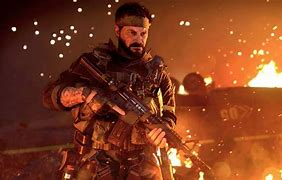

Call Of Duty ColdWar
====================

.. warning :: *Article may contain spoilers and hints at gameplay!*

*WELCOME, TO THE DANGER ZONE!*

**Background of Game**:
-----------------------

Call of duty Cold War was released on November 13, 2020. The world was stunned to have another call of duty game back to having boots on ground. The game itself has been in development for months after the release of Modern Warfare. The game creators fell back on the first call of duty black ops generator that ran the game back then due to the era the game fell back on.

**Campaign**:
-------------

"Rock Paper Shotgun" [#f1]_

When the game first dropped teasers for the insane graphics and in depth footage they gave with the campaign as well as the gore and the stressful areas they put you and the character you are playing as in. Throughout the campaign you are put through siutations where you have to make decisions that can effect how the ending goes for the game. The campaign is hands down probably the best feature in the game that was added and is definetely worth playing and taking the time and going through different scenarios and playing each one to the end and seeing how it goes. 10/10 recommend playing the campaign and exploring every choice you can.

**Zombies**:
------------

.. figure :: download.jpg
   :width: 500px

"Comic Book" [#f2]_

Now if you have followed the zombie storyline throughout the years this years zombie installment excited you. They took the game and threw it way back to call of duty world at war zombies and remastered the base starting map that was in that game. Zombies is a culinating nightmare that will make your adrenaline rush as the never ending hordes come running at you through the depths of hell! Jump into the awesome experience to feel the rush of not knowing what's going to be coming out of the deepest darkest corners of the game. Hop in gamer, SLAY THOSE ZOMBIES! 

**Multiplayer**:
----------------

.. figure :: multiplayer.jpg
 :width: 500px

"Black Ops Cold War Alpha" [#f3]_

This is the area the game falls off in my belief. I think the game itself was rushed when it comes to playing online multiplayer. It is almost as if the company rushed it because they felt threatened by Modern Warfare being out so they pushed for the development of this game. The movements feel like you are running through cement, the graphics are great, kill time is terrible, and the guns are either really over powered or it feels like youre shooting nerf darts at someone. I would not recommend getting on the multiplayer unless you want to throw your controller. Stick to Modern Warfare multiplayer or jump into the Warzone the open battleground to test your skills. All in all the game is great, the multiplayer is by far the worst game mode to play.

.. note :: *Gameplay is based off my experience you might enjoy the game*

At the end of the day I think the game was built good and I think it has a good platform, I still think it needs a little help and buffing out, but it will get there in time with a little help. With the good end coming from zombies and campaign and multiplayer being the only bad area I give this game a solid 5/10.

.. [#f1] "`Rock Paper Shotgun <https://www.rockpapershotgun.com/2020/09/17/call-of-duty-black-ops-cold-war-shows-some-singleplayer-action/>`_". cc@2020

.. [#f2] "`Comic Book <https://comicbook.com/gaming/news/call-of-duty-black-ops-cold-war-zombies-mode-trailer/>`_". cc@2020

.. [#f3] "`Black Ops Cold War Alpha <https://www.vgr.com/call-duty-black-ops-cold-war-alpha-five-new-maps/>`_". cc@2020
