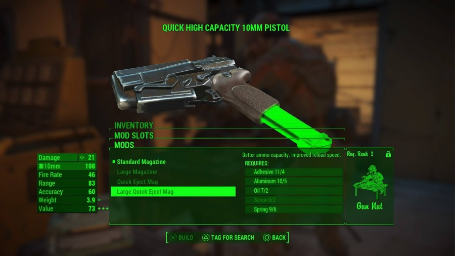

Fallout 4
=========

Despite its title Fallout 4 is the fifth game in the fallout series that was previous developed by **Black Isles Studios** but is now being developed and published by **Bethesda Studios**. Fallout 4 is a first- or third-person adventure role-playing game that follows the "*Sole Survivor*" as he explores the nuclear wasteland of the Commonwealth. Fallout 4 was realized worldwide on **November 10, 2015.**

.. figure:: fallout_4_box_art.jpg

Fallout 4 Box Art [#f1]_

Plot
----

In Fallout 4 you play as the "*Sole Survivor*"" of Vault 111 after you have been released from cryostasis. You awake to find that your spouse has been murdered and your son kidnapped by a mysterious group of mercenaries. You escape the vault and make your way to your old home to find your trusty robot nanny Codsworth who informs you that is no longer 2077 and that 210 years have passed since you entered the vault to escape the nuclear bomb. Now, convinced to find your infant son and save him, you must explore the wasteland and find clues about the location of your missing son.

Setting
-------

Fallout 4 takes place in the nuclear wasteland of the Massachusetts Commonwealth and centers on the ruined city of Boston. Incase you did not follow the events of the previous fallout games and this is your first game in the series the timeline of the fallout series is much different than the events of current history. Instead of condemning nuclear power the United States delved deeper into it. Soon all cars were nuclear powered, and all cultural advancements stopped in the 1960’s so everything still has that 60’s feel to it while still being futuristic. But in the year 2077 an incident happened which cause all world powers to launch their nuclear arsenal. Groups of Americans were able to escape into Vaults created by the mysterious company called Vault Tech. After escaping you vault you are shown the wasteland, it seems that humans were able to survive the wasteland and have created communities all over the irradiated commonwealth. The world varies from a bleak dim wasteland to empty cities, to even bustling villages of survivors. 

**Gameplay**

Gameplay in fallout 4 varies in that of its predecessors. It keeps the first and third person aspects as well as a lot of combat aspects of the older games it offers a lot of variation that keeps the game fresh even 5 years after its release. One variation that it offers is the new and improved crafting mechanic. Now instead of keeping up a weapon or armors condition, you now have a wide arrange of modification or mods that you can add to a weapon or armor piece. For example, a normal weapon has at least 6 different parts of the weapon that you can modify and with those options there are a number of options that you can chose from.

**The Basic Parts Common Weapon**

* Receiver

* Stock

* Magazine

* Barrel

* Muzzle

* Sights

Fallout 4 Crafting System [#f2]_

Another exciting addition that they made to the game is that of the settlement system. In the game you will run into a group that calls themselves the minutemen. Through adventures with this group the player is given the option to build and take care of a settlement. Here in these settlements you can create whatever your heart desires. Do you want to create a small quite town where you can live out your days in the wasteland or do you want to build a military bas where you can grow your army to take over the commonwealth. You can do either option or many more; with this new settlement system the wasteland is your oyster.

Another new mechanic that this game has brought is an overhaul on the roleplaying aspect of the game. In past games you were given a choice of lines that you character would say and then you would select a line and the game would give you the outcome. Now in Fallout 4 every single line your character says is voiced so instead of imagining what your character sounds like you can decide what voice they have. However, this does not mean that the game got rid of every mechanic that made the old games unique. The game still has its looting mechanic so you can explore the wasteland and find plenty of goodies to help make your character and wasteland exploring machine.

Speaking of old mechanics, one gameplay mechanic that the game has kept from the previous games will make every longtime fan happy. Yes, it is the return of the Vault-Tec Assisted Targeting System (V.A.T.S.). With this system the player is able to slow down time ad calculate the chance of hitting a certain part of an enemy for extra damage. Since the combat in the Fallout series can sometimes get hectic this is a needed mechanic that can help slow down combat and can sometimes even decide the outcome of a fight. 

Final Verdict
-------------

Fallout 4 is an amazing continuation of the critically acclaimed Fallout franchise. Its story keeps you guessing and with multiple endings and Bethesda’s open acceptance of game mods the games replay ability is amazing and keeps players coming back five years after its release. If you are looking for a game to help get you through the next quarantine, I highly recommend that you get a copy of Fallout 4.

.. [#f1] "`Fallout 4 Box Art <https://www.mobygames.com/game/fallout-4/cover-art/gameCoverId,317272/>`_". Mobygames. 2015. Retrieved 2020-12-3.

.. [#f2] "`Fallout 4 Crafting System <https://www.vg247.com/2015/11/17/fallout-4-weapon-crafting-guide-3/>`_". VG247. 2015. Retrieved 2020-12-3.