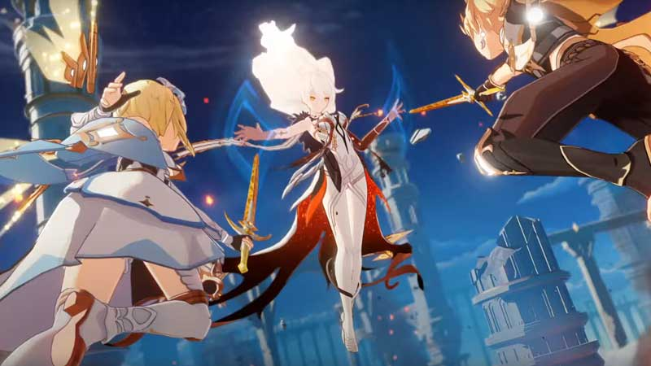

Genshin Impact
==============

What is Genshin Impact?
-----------------------

Genshin Impact is Genshin Impact is a three dimentional anime open world styled RPG. RPG stands for role playing game. This game's progress and ending is dependent on the player's choices.

Genshin Impact is a free-to-play action role-playing game developed and published by **miHoYo**. The game features a fantasy open world environment and action based battle system using elemental magic, character switching and uses gacha game monetization for players to obtain new characters, weapons, and other resources.

Why is Genshin Impact so popular?
---------------------------------

Genshin Impact is popular and developed a large fanbase due to the story line and the characters. The story line is very unique and engaging and the characters are also unique. The creaters put a lot of throught and effort into each characters look, voice lines, and backstory. The smoothness in animation also attract many gamers.

.. figure:: genshin_childe.png

Plot
----

A pair of twins who travel across the stars and visit different worlds arrive in Teyvat but are separated by an unknown god, who takes one and seals away the other. Some undisclosed amount of time later the sealed twin, referred to as the "Traveler", awakens and meets Paimon. The pair decide to travel to nearby Mondstadt to start their search for their missing twin.

How the game works
------------------

You complete quests, defeat monsters, and gain experience. You also earn characters and artifacts. Artifacts and weapons are super imprtant in the game, along with skill levels and constellations. Artifacts have a theme stack that when paired with the right character, can lead to serious damage dealing. Weapons and artifacts are based on the character themselves. 

An example is the next few images that are screenshots. The character's name is Xianling who is a fighter or a DPS character. 

Reviews
-------

"I really enjoy the open world aspect and what the game has to offer. I am not at a high level in the game so I have not gotten the full experience. I like the limitations of traveling, like when it stops me from going to far from something. I also like how the enemies and the world level up with me so the monsters aren't one hits. The game gets herder as I level up so it stays a challenge. I also like the CO-OP experience so friends can help you when needed. I also like the wish mechanice using the gatcha concept. Its a smart way to take money from my wallet but its nice to roll cool items or characters. The only thing I don't like is its hard to have good gatcha rolls. I constantly spend money because it's all based on luck. Overall 4/5" - Anonymous

"Genshin Impact is a fresh and colorful action RPG with a surprising amount of content for being free to play, with more additions to come." - Multiplayer.it (metacritic.com)

"Very Similar to BOTW , But have its own charm , World Exploration is very satisfying. + Lisa Voice and A lot of waifus 9/10. The only problem is it's very grindyyyyyyy." angjansen114 (metacritic.com)

"Genshin Impact: I kind of get it 7/10
If there is one thing you can say about Genshin Impact (GI), it is that their design team really knows how to analyze
a game. Like many who first saw the game, I was convinced it was just a Legend of Zelda: Breath of the Wild
(BotW) rip-off, and in many ways it is. I really want to hate the game, but much like my subconscious dislike of
Fortnite, I always have to question if it&#39;s the &quot;get-off-my-lawn&quot; attitude toward some games that I have developed with age.Genshin Impact has many of the hallmarks of games I distain: Loot-boxes, Low Drop Rates, Gated pay-2-play
energy scheming, and an annoying sidekick. This all being said, what really surprises me is how much I don&#39;t hate
the game. For context, I have previously written a scathing review of BotW, so for me not to do the same with a
game which shamelessly copied from a source I am not wild about is steeped in irony. For all the things GI does to singe my nose-hairs, it has had some precise decisions on what to take from other
games which meld together to focus on a generally fun experience. As far as RPGs go, the storyline is compelling in
it’s own way, and the exploratory aspects of it’s spanning world give content on the level of a game designed with
procedurally-generated elements. Unlike BotW, enemy design is varied, and effective attack methodology
requires thought. Paired with a diverse set of actions, enhance character mobility, and a large set of quickly
swapable skills, GI gives the gameplay a perfect balance between Devil-May-Cry action, and Souls-Like intentional
movement. In between storyline, when you are level gated, the game keeps you busy by providing a rather large array of
puzzles, so as to focus on diversity of experience. One of the things about BotW I never liked was the repetitive
nature of it’s puzzle scheming, something GI has taken time to adjust. The result, is a varied set of experiences,
making the actual gameplay fun enough, that you don’t mind it is stopping you from pushing in to the typical
grinding cycle. Genshin Impact still takes it’s monetization queues from games like Raid: Shadow Legends and Arknights. Loot
boxes can be purchased for $3 each under the name of “fates.” Fates are the main way in which you can attain
new characters or weapons, but the rate at which they drop is often as low as .6%. That’s not 6/100, that’s 6/1000.
Meaning, on average, to get some of the rarest items, you would need to spend upwards of $500. End-game actions are also gated by an energy resource called “Resin” which effectively functions the same as any gated activity in mobile games. In order to upgrade your characters, you have to spawn bosses to fight which
require resin, but you can only get so much resin per day. If there is any benefit here, it is that it self-regulates the
amount of effective hours younger gamers can play in a day to actually make progress, but the game is fun enough
that this might not actually stop them from playing.
In the end, the game is an interesting first foray in to driving free-2-play style Mobile gaming on a PC platform, and
supports the creation of a large community by providing access to the game on a wide set of platforms. If you are
looking for something to take up your time and enjoy gameplay, it isn’t the worst choice you could make, and can
provide some decent fun for minnow or dolphin spenders, who are not in a financial situation to spend $69-$120
on a game to buy 100 hours of play time. You can definitely get that much gameplay out of GI for much less
investment." - Richard Stanley

Reviews cited from metacritic.com/game/pc/genshin-impact