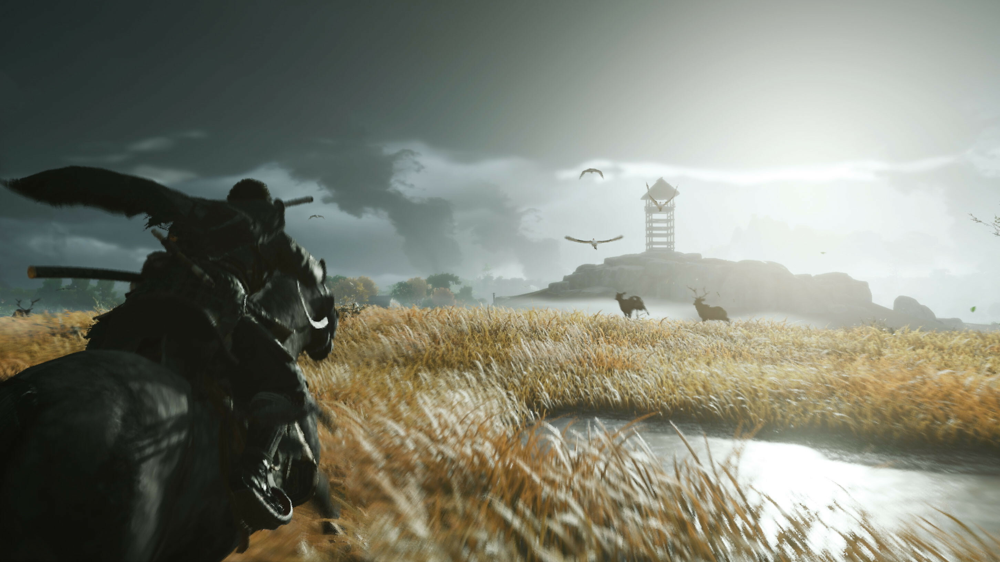

Ghost of Tsushima
=================

Ghost of Tsushima, a PlayStation exclusive, is the latest game from **Sucker Punch 
Productions**. This game studio is credited for producing the highly acclaimed 
Infamous series and Sly series. Ghost of Tsushima is Sucker Punch Productions' first 
new IP in over *six years* and they knocked it out of the park. Ghost of Tsushima is 
a mixture of Souls-like gameplay and classic RPG elements like Skyrim. Being released 
on July 17, 2020, Ghost of Tsushima was the last major PlayStation exclusive of this 
console generation. If there were a game to end a console generation on, it would be 
Ghost of Tsushima. Its polished gameplay, good graphics, and a great story make Ghost 
of Tsushima the perfect end cap for a console generation.

Plot
----
Ghost of Tsushima follows Jin Sakai, the last surviving member of clan Sakai, and his 
mission to take back the Island of Tsushima from Khotun Khan and his Mongol invasion 
force. As Jin travels across Tsushima and liberates towns, and destroys Mongolian 
camps, he slowly dips out of his traditional samurai fighting tacks and begins to 
adopt the way of the *Ghost*. This fighting style earns him a reputation among 
Tushima's residents and the Mongolian invaders as an unkillable legend. 

Setting
-------

Jin Sakai Traveling Tsushima [#f1]_

Ghost of Tsushima is set on the real world Japanese Island Tsushima in 1247 during 
the first Mongolian invasion. The open world of Turshima is split up into three 
provinces called Izuhara, Toyotama, and Kamiagata. Throughout these three provinces, 
the player will discover the amazingly detailed world that the developers have 
created. Open plains full of grass in seed, snowy mountain tops, vast bamboo forests, 
and cherry blossom trees in full bloom paint Tsushima's countryside. All of these 
work together to create an extremely immersive and beautiful experience for the 
player.

Gameplay
--------

Ghost of Tsushima offers a large varity on how the player progessis through the
narative of the game. Through out the world the player will discover diffrent areas
that will allow them to increase Jin's health, resolve, charm slots, earn new gear or 
charms, or earn resoreces to upgrade/dye gear already possesed. All this helps create
and emersive action-adventrue game that that can be taliored to the player's play
style. 

Ghost offers four difficulty modes!

#. Easy
#. Normal
#. Hard
#. Lethal 

.. note::
	**Leathal causes the player to die in just one hit**. I recomend playing on normal or hard then on a second playthrough play on lethal.

Combat in Ghost of Tsushima is very relatable to a souls game. This means that the 
player will have to manage their health and become proficient at blocking, parrying, 
and dodging enemy attacks. Luckily Ghost of Tsushima is a lot more forgiving than an 
actual souls game, making it easier for players to learn the mechanics.

As Jin disrupts the Mongolian invasion, he will earn fame. Fame acts as the XP for 
the game, and once a player makes enough fame, Jin's legend grows. As Jin's legend 
grows, he earns skill points to upgrade weapons, fighting stances, and tactics. Along 
with this, Jin will become more feared by the Mongolians as his legend grows. A 
notable aspect of the combat system is that players can choose to either put skill 
points into Ghost skills or Samurai skills. This further allows the player to tailor 
the game to their play style. Do you want to rush in and call enemies out? Put points 
into the Samurai skills. Maybe you would rather sneak through the enemy base using 
poison and assassinations to kill the leader silently. Then put skill points into 
ghost skills. These skills are further heightened with the ability to switch stances 
to take on the main enemy types properly. 

+--------------+--------------+
| Stances      | Enemy Variant|
+--------------+--------------+
| Stone Stance | Swordsmen    |
+--------------+--------------+
| Water Stance | Shildmen     |
+--------------+--------------+
| Wind Stancne | Spearmen     |
+--------------+--------------+
| Moon Stance  |  Brutes      |
+--------------+--------------+

Final Verdict
-------------
Ghost of Tsushima is a fantastic action-adventure with a great combat system and a 
beautiful open world. While there were a few glitches at launch, they have long since 
been patched by the developers. Along with this, they released free DLC for customers 
that purchased their game. On top of this, it has been nominated in several 
categories at this year's game awards. To me, it is a must-play if you own a 
PlayStation. If you would like to buy yourself a copy `click here <https://www.playstation.com/en-us/games/ghost-of-tsushima/>`_.

.. [#f1] "`Jin Sakai Traveling Tsushima <https://www.gamespot.com/articles/ghost-of-tsushima-legends-raid-starts-today/1100-6483639/>`_". Game Spot. 2020. Retrieved 2020-11-29.

