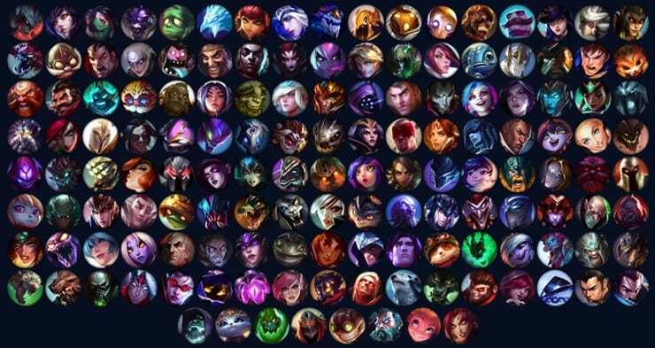

League Of Legends
=================

League of Legends is a top down multiplayer game. You play against other people to destroy a main objective to win the game. You can play with friends or random people.
In this review i am going to cover modes, champions, items, and mechanics.

Modes
-----
To start off the game, you have to go through the tutorial which guides you through how to play. After you have completed that you are able to play a bunch of different modes. The most popular mode is ranked.
You can play ranked solo/duo or ranked flex which is for groups bigger than one or two people. Then there is draft which is not ranked and more casual. Every gamemode goes the same in terms of mechanics. There are five people on each team and you fight them and waves of AI. 

LOL AI [#f1]_ 

You have to destroy towers as you move towards the center of their base. The first one to destroy the nexus, their center, wins the game. These games can go up to an hour long, but normally last around 30 minutes.

Champions
---------
There are five different roles you can pick from in this game. 

Roles

#. Top
#. Jungle
#. Mid
#. ADC
#. Support

Champion List [#f2]_

The top laner is a tank that, you guessed it, goes to the top lane. The jungler can be a tank, squishy, and even ranged character that roams through the map and helps out other lanes. The mid laner goes to the mid lane and is normally a mage. The ADC stands for *Attack Damage Carry*, which means that they are ranged champs. Finally the Supports go with the ADC and normally have healing or shielding abilities to help them out.

.. warning::
	Junglers are very important to winning games so practice before playing!

Items
-----
Over the course of the game you will earn money for killing people, minions, and from a stable income. With this money, you can buy items that will give you certain stat buffs. There are hundreds of items in the game so there are many different ways to play each champion.
Having more items than your enemy will win you fights, and overall the game.
It takes practice to learn what items to buy for which champs you are playing and even when to go an buy your items.

.. [#f1] "`LOL Minions <https://leagueoflegends.fandom.com/wiki/Minion_(League_of_Legends)>`_".League of Legends Wiki.2020.Recieved 12-2-2020.

.. [#f2] "`Champion List <https://thegamehaus.com/league-of-legends/how-many-champions-are-currently-in-league-of-legends/2020/09/23/>`_".Game Haus.2020.Recieved 12-2-2020.