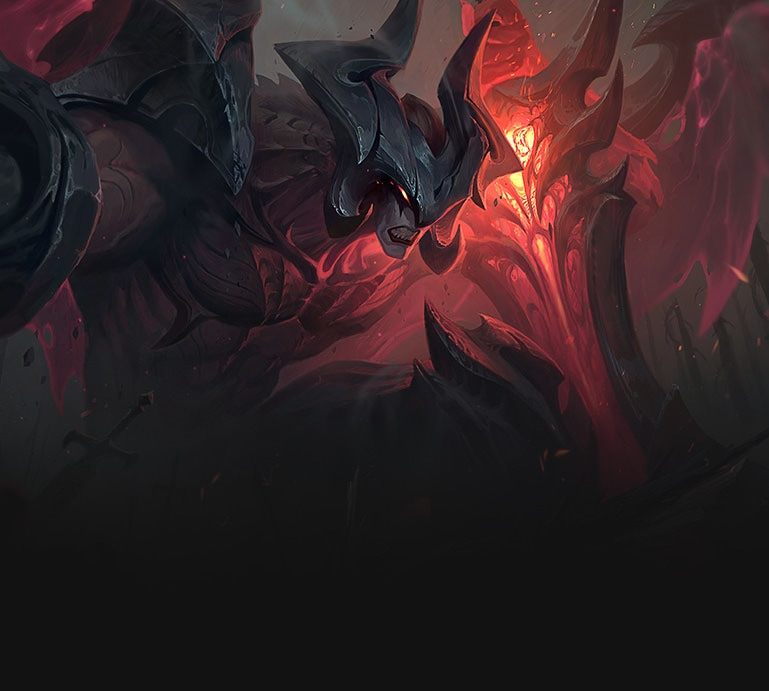
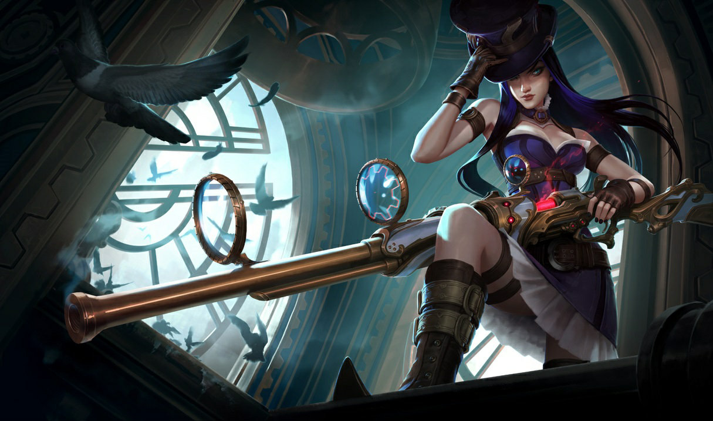

League of Legends (Part2)
=========================

What are the different roles?
-----------------------------

**Fighter** or **Top Lane** is the tank. These champions (along with some supports) have the most HP. Typically, the top lane is the solo lane. Most Top Laners are melee champions. 

An example of a **Fighter** is Aatrox. Aatrox uses the spells Flash and Teleport. Flash alows them to move a small distance in an instant. It's useful for a sticky situation. Teleport allows a champion to teleport to a vision ward or a turret. 

Runes **Top Laners** would use are Electrocute which helps with true damage and Resolve which is great for defense. 

**Mid Lane** is the champion for the middle lane of the map. Your mid lane player is the core of any team and is arguably the most difficult role to play in League of Legends. This is due to the amount of game knowledge needed to perform well in the role. Mid laneers are squishier and are both ranged and melee. You can choose from mages to fighters, from assassins, to a mix of multiple classes. 

An example of a **Mid laner** is Ahri. Ahri uses Flash and Ignite. Ignite does small and short burn damage to an enemy champion. Her runes are Electrocute and Sorcery (Sorcery because she is a mage).

.. figure:: ahri.jpg

The **Jungler** is the champion that roams around the jungle. Their job is to attack the monsters in the jungle, gain vision in the jungle, and get buffs fo their team. The air mainly melee but they can also be ranged. The jungler does not earn xp or gold as fect but they are still essential to the game.

An example is Volibear. Vilobear always uses flash but can switch between ignite and teleport. This particular champion builds for defense and ability power.

.. figure:: volibear.jpg

The **ADC** or **Bot Lane** is the damage dealer. ADC (Attack Damage Carry) is an archaic term used to refer to a champion that deals strong, continuous damage with their basic attacks and scales with attack-related stats - i.e. attack damage, critical strike chance and attack speed. Most if not all of the champions are ranged. 

An example is Caitlyn. Caitlyn uses movement speed and sorcery and focuses on a crit chance and a damage build. 

Finally, the **Support** is the hero that will keep the enemy in place or will bring them into range for the **ADC** s. The **ADC** s get all of the kills while the **Supports** get all of the assists in the kills. The supports also keep up with vision on the map and tend to take more damage. 

An example is Thresh. Thresh uses HP and defense for runes and builds using defensive items. Because supports take damage, they need the health to take it. 

.. figure:: thresh.jpg

Reviews
-------
"I get mad at this game. I want so bad to be good at this game but I fail as you have to know so much about what each characters can do, what items are the best and how each plays. My husband loves this game though and he is a good player." - Aimee D. (influencer.com)

"I've played this game for a good 3-4 years and it's a pretty good game to play. The only real down side is that quite a bit of players are; very toxic, close-minded, or just out right horrible people. If you can rummage your way past the hate and rage, you'll meet some very good heart players and even enjoy the game more." Bernadette A (influencer.com)

"This game is really good for team building exercises. My team is great and we got closer through the game. The game doesnt require any money to play and its fair no matter how much you end up spending." Jumster (commonsensemedia.org)

Reviews cited from influencer.com/reviews/league-of-legends

Reviews cited from commonsensemedia.org/game-reviews/league-of-legends