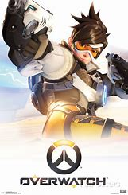

Overwatch
=========

Overwatch is team-based multiplayer first-person shooter developed and published by **Blizzard Entertainment**. The game is often referred to as a hero shooter as the player is placed into a team of six and is given the option to play a multitude of heroes. Depending on the game mode that you play you must complete a number of objectives to defeat you opponents. The game is currently one of the few games that has a dedicated Esports League dedicated to it and was released on May 24, 2016. 

Overwatch Box Art [#f1]_

Game modes
----------

While there are a multitude of different match types and events that the game offers, I will be focusing on the main match types that appear in competitive and quick play as well as the mechanics of the game. 

.. note::
	**These are not the only game modes**. Overwatch had plenty of game modes that are in and out of rotation such as **Deathmatch** and **Capture The Flag**. These are just the most common ones

Assualt
-------

Firstly, the game offers four different match types – Assault, Control, Escort, and Hybrid. In Assault an attacking team will have to attempt to take two points before time runs out. Meanwhile a defending team must try to stop them from fully taking the points. The longer the attacking team stays on the point the bigger the control percentage will be until they capture it. If the attacking team steps off of the point their percentage will go down, and if a defending player is on the point at the same time as the attacking player the percentage will not change. If both the attacking team has not fully captured the point before time runs out but they are still on the point Overtime will trigger until their capture the point or they are removed from the point. 

Control
-------

The game mode control is similar to that of assault accept there is no defending team. Each team must attempt to capture and hold a point long enough for their percentage to reach 100% before time runs out. However, unlike Assault if your team is removed from the point your capture percentage does not go down. Instead it stays at the percentage in which you were removed, and you must attempt to retake the point before the other team fully captures it. Control is a best two out of three matches game mode. So, to actually win the game you must win two matches which means capturing two points fully. If time runs out before a team reaches 100% on a point, then Overtime will occur until a team has done so. However, if an opposing player is on the point while you are at 99% the point will not go to 100 until that player is removed. 

Escort
------

In Escort an attacking team must deliver a payload to a certain point of the map before time runs out while a defending team must stop them from delivering the payload. Each Escort map has between two to three checkpoints that will refill the timer and reset each team’s spawn points. If the attacking team is away from the payload for a certain amount of time the payload will begin to move backwards towards its latest checkpoint. Overtime is initiated if time runs out and the payload is being contested by a member of the attacking team.

Hybrid
------

As the name implies the game mode Hybrid is a mix of the Assault and Escort game modes. The game starts with the attacking team attempting to capture a point like in Assault while the defending teams attempts to stop them. If the attacking team is successful, then they must deliver a payload to a different part of the map like in the game mode Escort. Each section of the game behaves like the stand-alone counter parts.

+----------+--------------------------------------------+
|Game mode | Short Description                          |
+==========+============================================+
|Assualt   | Attacking team must take **two** points    |
|          | from the defending team.                   |
+----------+--------------------------------------------+
|Control   | Both teams must capture a point on the map.|
|          | Best **two** out of **three** points.      |
+----------+--------------------------------------------+
|Escort    | Attacking team must escort a **payload**   |
|          | to a certain point on the map.             |
+----------+--------------------------------------------+
|Hybrid    | Hybrid of the **Assualt** and **Escort**   |
|          | game modes                                 |
+----------+--------------------------------------------+

Gameplay
--------

In Overwatch the player has three different types of heroes that they can play as- Damage, Healer, or Tank. Each team is comprised of two players from each role. As its name suggests damage heroes are used to deal damage to the other team. If you chose a damage hero your aim must be on point as even the slightest miss can mean failure of success for you team. Damage players will use their mobility and damage dealing prowess to either sneak behind enemy lines are bash their way through their shields to take out the enemy. Healers are the most important part of a composition. Most healers will make call outs on enemies and say when an enemy has broken the lines while also keeping their teammates healthy. Healers do not get a lot of kills like damage or tank players but if your healer does their job right, they will be able to keep the team healthy and stop incoming attacks in their tracts. Tank players are damage sponges. Their job is to soak up incoming damage and protect the healer and damage players so they can do their jobs correctly. While tanks can get kills it is not their job to go head hunting. If a tank player is greedy it leaves the back line open to attack and can mean instant failure for your team. Each role has their job and if the players can do their jobs and mesh properly you will find that success will come easy to you. 

.. figure:: overwatch_heroes.png

Some of Overwatch's Heroes [#f2]_

Final Verdict
-------------

Overwatch is an outstanding example of a hero shooter. Its game play and pro scene offer endless strategies that players can try out and gives the opportunity for you and your friends to get together and dominate in multiplayer. The game has been out for four years now and it is no wonder players keep coming back for more. If you would like to learn more about Overwatch and their Pro Scene you can check out their website. `click here <https://playoverwatch.com/en-us/>`_.

.. [#f1] "`Overwatch Box Art <https://www.ebay.com/c/1276629365>`_". Ebay. 2020. Retrieved 2020-12-3.

.. [#f2] "`Some of Overwatch's Heroes <https://siliconangle.com/2016/04/25/overwatch-beginners-guide-choosing-your-hero/>`_". siliconANGLE. 2016. Retrieved 2020-12-3.