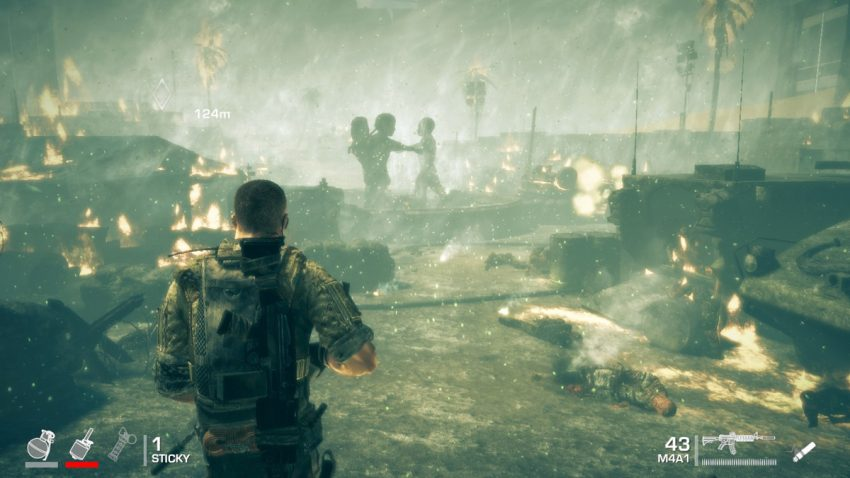

Spec Ops: The Line
==================

Spec Ops: The Line is a game developed by Yager studios and is published by 2K Games. Spec Ops: The Line is one of 4 games
developed by Yager Studios and is the 10th title as well as reboot to the Spec Ops Series. While the Campaign was developed
by Yager studios, Darkside Game studios oversaw the multiplayer. While the game seems to be a bland creation
of a Heroic war shooter, players will soon find out the developers had a deeper meaning behind the gameplay and story.
Spec Ops: The Line is available to Xbox 360, playstation 3, and PC gamers.

Overview
--------
Six months had passed since Dubai was tarnished into oblivion by an atrocious sandstorm. Prior to the storm, the 33rd Army battalion led by
**Col. John Konrad** was returning home from Afghanistan when the storms hit. Unable to leave the refugees behind Col. Konrad volunteers the 33rd to stay
behind and attempt to evacuate the city. The U.S. had ordered the 33rd to return but Col. Konrad along with the rest of the 33rd chose to desert
in order to save the refugees. Rallying up a caravan, the 33rd soon realized the hopelessness of the evacuation which had failed. To restore order,
the 33rd inducts martial law. Between riots and scarce resources, the 33rd became brittle and crumbled under the intensity of Dubai. All was silent
until a message broke through: This is Colonel John Konrad, United States Army. Attempted evacuation of Dubai ended in complete failure. Death toll: too many to count.

Plot
----
The player takes on the role **Cpt. Martin Walker** and you lead **Lt. Addams** and **SSgt. Lugo**. The mission is simple: Locate survivors
and radio for evacuation. In the beginning, you locate the mysterious radio signal and stumble upon survivors. One Problem:
the survivors are referred as *The Insurgents* and are armed and fire at your squad immediately. Feeling forced, you an your squad return fire.
Upon traversing through the harsh desert and fighting off the Dubai survivors, you hear soldiers hailing for backup. As
your squad moves in to assist the unit, you soon find out the soldiers are the remnants of the 33rd. Upon pursuing surviving
33rd, you're mistake for CIA, who has been rallying *Insurgents* to challenge the 33rd. You're then caught in trying to determine who is friend
and who is foe. What you will come to understand is: *Don't be a hero*.

The game has 4 difficulties:

* Walk on the Beach
* Combat Op
* Suicide Mission
* FUBAR

.. note::
   The player must have completed the campaign on Suicide Mission to play on FUBAR

Gameplay
--------
Spec Ops: The Line takes place in the unforgiving desert of Dubai. Even though the country is practically buried under you will traverse through the landscape as well
as buried skyscraper. Although the falls are scripted you will find yourself falling into sinkholes. As you travel through Dubai you start to get an idea of what really
happened in Dubai and how everyone got by. The game is a third person shooter and will have you choosing between wide arsenal of weapons to use against your foes. The game
introduces you the **Squad Command** mechanic which forces you to play more with your team rather than running and gunning as a lone wolf like other shooters. Don't forget you're fighting in a desert.
Occasionally a sandstorm will blow in during a firefight, causing you to have lowered visibility and weapon stability. Additionally you are seemingly traversing in a vertical path, an example
would be the constant ziplines setup throughout the game. You will notice whenever you get a headshot the game will enter slow-mo. When you critically damage your opponents you can
causing them to be downed and allowing you to execute them

White Phosphorous [#f1]_

Spec Ops: The Line relies heavily on your conscience by giving you moral decisions which have no affect on the gameplay. You will be given choices such as saving certain people over others and then
discover it did not matter who you saved. The game will constantly ask you as you progress through the game, "Do you feel like a hero yet". The more good you try to do in the game the worse you make your own situation.
All Cpt. Walker had to do was radio for evacuation but he kept pushing him and his squad towards their limits. Eventually you will come across a scene where enemies seem to number in unbearable numbers and one of your
squad members spots a mortar with white phosphorous rounds. After clearing 33rd soldiers and burning everything in your path you stumble across civilians who had also perished in your rampage.As you play the game
the characters become irritable towards each other especially when you use Squad Commands. You will also notice your executions becoming more brutal as you keep trudging towards your foolish goals. Additionally, your
clothes will become a tattered mess and your body will show signs of faltering, although your performance doesn't change. The game is not meant to leave a hole in your stomach but rather cause you to think about
how you approach shooting games.

Guns
----
+--------------+-------------------+----------------+---------------+---------------+
|   Handguns   |  Submachine guns  | Assault Rifles |    Shotguns   | Sniper Rifles |
+--------------+-------------------+----------------+---------------+---------------+
|  Beretta M9  |       FN P90      |      M4A1      |     AA-12     |   Barret M99  |
+--------------+-------------------+----------------+---------------+---------------+
|   D. Eagle   |    Micro   Uzi    |      FAMAS     |   Benelli M4  |     MSG90     |
+--------------+-------------------+----------------+---------------+---------------+
|    Magnum    |       UMP 45      |    FN SCAR-H   |  Mossberg 590 |   M110 SASS   |
+--------------+-------------------+----------------+---------------+---------------+
| Colt Python  |        MP7A1      |      AK-47     |  Model 1300   |  Steyr Elite  |
+--------------+-------------------+----------------+---------------+---------------+

.. [#f1] "`White Phosphorous <https://thegatewayonline.ca/2018/02/spec-ops-the-line/>`_". The Gateway. 2018. Retrieved 2020-12-04.
