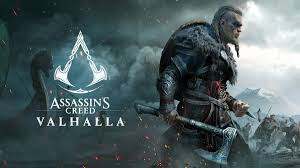
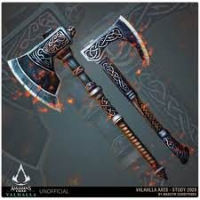

Assassin's Creed Valhalla
=========================

Assassin's Creed Valhalla is the 12 game in the AC series and was developed by mainly by **Ubisoft Montreal** and was published by **Ubisoft**. 
Valhalla was released not to long ago on November 10th, 2020 This type of game, just as all AC has been, is a skyrim like game with more story.
For this review i am going to go through the plot, weapons, abilities, and gameplay.

Plot
----
To start off the game you are going back to the main character s a child. you are a nordic viking and your clan is merging with another clan to make you both stronger.

Valhalla Cover [#f1]_

You are in the night of the feast where both clans will be bonded forever. However, there is a invasion of a enemy clan. The leader of this clan kills you mother and father, but the allied clans oldest son get you out.
From then on you time skip to when you are older. 
You hunt down the man that killed your parents and continue on hunting those that work in his same organization.

Weapons
-------
You start off with a one handed axe, and this is the most prominent type of weapon you can use. There are many other types of weapons such as two handed axes, bows, and flails. 

One-handed Axes [#f2]_

There are more weapons as well and many special weapon. These are weapons that can be found in a certain spot like Thors Hammer. 
So in this game there are so many way to fight and play.

+--------------+--------------+
| Gear Type    |  Orientation |
+--------------+--------------+
| Yellow(Raven)| Stealthy     |
+--------------+--------------+
| Blue(Wolf)   | Ranged       |
+--------------+--------------+
| Red(Bear)    | Melee        |
+--------------+--------------+

Abilities
---------
The abilities in this game are very strong and still balanced. The way to get new abilities in Valhalla is through exploration. There are icons that show you where new abilities are.
You have to clear the area and sometimes solve a puzzle to get to it. Once it is learned you can equip it and enjoy. There are many abilities in this game and you are allowed to equip 4 melee type abilities and 4 bow abilities at any given time.

Gameplay
--------
Everything runs very well and the story is a lot of fun to play. The story is a bit slow so some people may not like that, but it makes the game last a lot longer.
Another big this is that you are able to play as different variants of the same main character which makes the experience different depending on what you pick. You can be a male version, a female version, and a non-binary version.

.. [#f1] "`Valhalla Cover <https://www.dailystar.co.uk/tech/gaming/assassins-creed-valhalla-first-look-21953541>`_". Daily Star.2020.Retrived 12-2-2020.

.. [#f2] "`One-handed Axes <https://www.deviantart.com/sattriel/art/Assassins-Creed-Valhalla-weapons-study-Axes-847582169>`_". Deviant Art.2020.Retrieved 12-2-2020.